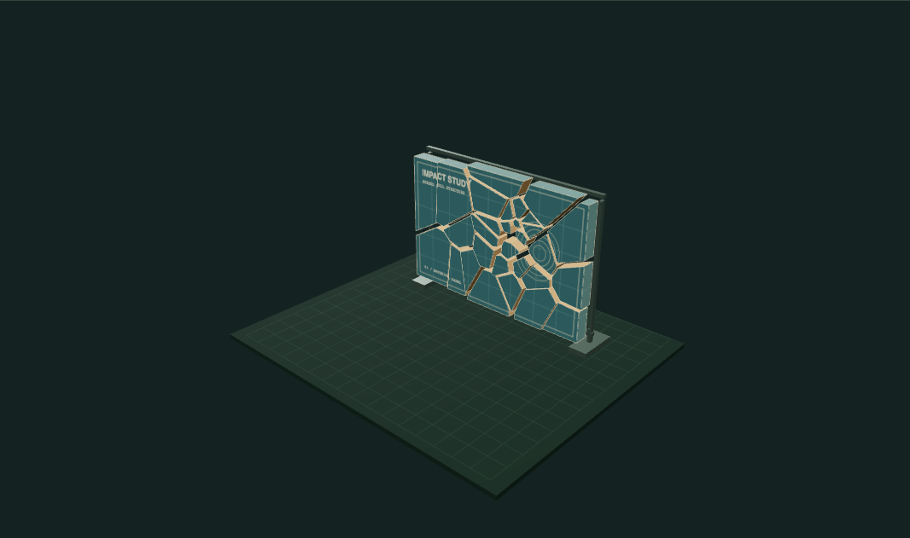
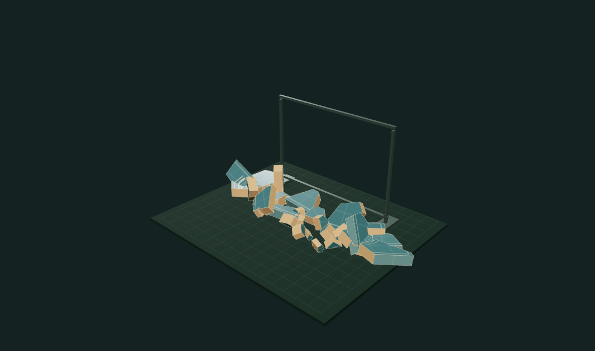

# Fracture Sandbox

Cut a thin solid panel into impact-dependent Voronoi fragments, inspect its interior surfaces, and replay a computed rigid-body trajectory in either direction.

## Run

Place the shared `GraphicsWorkbench` runtime beside this repository when using its local file dependency:

```sh
npm install
npm run dev
npm test
npm run build
```

Portfolio and standalone views both import `createExperiment(ctx)` from `src/index.js`. No GitHub Actions are included.

## Workflow

1. Click the intact panel to place an impact, or set its horizontal and vertical position with the sliders.
2. Choose a fragment count, seed and impact strength, then **Generate cuts**. The impact changes the actual seed distribution and clipped cell boundaries. Around 65% of the sites are concentrated around it; the remaining sites cover the panel.
3. **Fracture panel** plays the cached trajectory. Pause and scrub the four-second timeline, or **Reassemble** to reverse the exact stored motion back to the original centroids and orientations.
4. **Separate cuts** pauses at the unbroken arrangement and spreads its actual cells for geometric inspection. The differently colored side faces are cut surfaces, not painted cracks.
5. Export the visible fragment arrangement as OBJ, or save the Voronoi polygons and construction parameters as JSON. Undo restores the previous generated cut arrangement.

Ceramic, Plaster and Glass are appearance presets. They change the surface material; they do not claim to simulate different fracture toughness.

## Geometry and motion

`src/fracture.js` is pure JavaScript. Each site’s convex cell starts as the full panel rectangle and is clipped against every other site’s perpendicular-bisector half-plane. Cells are triangulated on both front and back and connected with side quads, producing closed solid prisms. Interior faces are classified separately from the original panel surfaces.

The simulation initializes velocities using each cell’s distance and direction from the impact, then advances at 1/120 second. It integrates gravity and quaternion rotation, finds the lowest rotated vertices, and applies floor contact with restitution, contact torque and damping. Frames are saved at 60Hz and interpolated during scrubbing. Random construction and launch parameters come from a deterministic seed.

This uses the nearest-site geometry described in [Aurenhammer’s Voronoi diagram survey (1991)](https://doi.org/10.1145/116873.116880); it is an extruded-cell fracture experiment rather than an implementation of volumetric crack propagation.

## Limits and tests

Cells are cut in 2D and extruded through a rectangular panel. Arbitrary 3D inputs, nonconvex fracture, stress propagation, shard-to-shard collision and collisions with the display frame are not implemented. The floor solver uses a compact contact approximation rather than a general rigid-body dynamics engine. Separated inspection deliberately offsets fragments outside the physical trajectory.

Tests verify deterministic seeds, impact-dependent geometry, area conservation, two incident faces per triangulated edge, valid normals and finite rigid transforms, vertex-level floor clearance, exact reassembly state and bounded inputs. `examples/` contains rendered states from this implementation rather than generated illustrations.

## Run and explore

[Open the portfolio demo](https://zachsm.com/experiments/fracture-sandbox). This repository runs independently and exports the same implementation used by the portfolio.

Requires Node.js 22 or later.

```sh
npm ci
npm test
npm run dev
```

`npm run build` produces a static site in `dist`. Editing, uploaded files, and exports stay in the browser. No account, server processing, or GitHub Actions is required.

## Captured examples



30 closed Voronoi cells · separated to expose interior faces.



The same fragments · 1.18 seconds into the computed impact.

Exact reproduction steps are recorded in [the example manifest](examples/manifest.json).
